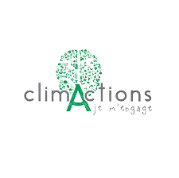

<div id="top"></div>

(https://codeclimate.com/github/greta-code-pizza/climactions/maintainability)
[![Contributors][contributors-shield]][contributors-shield]
[![Forks][forks-shield]][forks-url]
[![Issues][issues-shield]][issues-url]

<br />
<div align="center">
  <a href="https://github.com/greta-code-pizza/climactions">
    
  </a>
  
  []

  <h1 align="center">Clim'actions - Centre de Ressources</h3>

  <p align="center">
    Projet en collaboration avec le GRETA de VANNES
    <br />
    <a href="<!-- Mettre le lien -->"><strong>Explorer la documentation »</strong></a>
    <br />
    <br />
    <a href="<!-- Mettre le lien -->">Voir le site</a>
    ·
    <a href="https://github.com/greta-code-pizza/climactions/issues">Reporter un Bug </a>
    ·
    <a href="https://github.com/greta-code-pizza/climactions/issues">Faire une demande de Feature</a>
  </p>
</div>

<details>
  <summary>Sommaire</summary>
  <ol>
    <li>
      <a href="#a-propos-projet">A propos du Projet</a>
      <ul>
        <li><a href="#techno-utilisees">Technologies utilisées</a></li>
      </ul>
    </li>
    <li>
      <a href="#mise-en-place">Mise en place</a>
      <ul>
        <li><a href="#pre-requis">Pré-requis</a></li>
        <li><a href="#installation">Installation</a></li>
      </ul>
    </li>
    <li><a href="#usage">Usage</a></li>
    <li><a href="#contact">Contact</a></li>
  </ol>
</details>

## A propos du Projet :

Clim'Actions est une association et un laboratoire d’idées et de projets pour anticiper et agir face au changement climatique.

Son but : mobiliser, le plus largement possible, les acteurs sociaux, économiques et politiques pour engager des actions d’atténuation et d’adaptation du territoire aux conséquences déjà visibles du changement climatique.

Cette Application va permettre aux utilisateurs de pouvoir réserver des livres, CDs, jeux, telle une "Médiathèque" spécialisée sur le climat et les enjeux environnementaux.

<p align="right">(<a href="#top">back to top</a>)</p>

### Technologies utilisées :

- HTML / CSS
- PHP (en structure MVC)
- SQL
- JavaScript / Jquery

<p align="right">(<a href="#top">back to top</a>)</p>

## Mise en place

### Pré-requis

* composer

```sh
composer install
```

<p align="right">(<a href="#top">back to top</a>)</p>

### Installation

Clone le repo

```sh
git clone https://github.com/greta-code-pizza/climactions.git
```

_Pour pouvoir accéder à votre base de données, vous avez le fichier .env.example qui faut renommer en .env et préciser les informations de votre base de données._

<p align="right">(<a href="#top">back to top</a>)</p>

## Contact

Clim'Actions - contact@climactions-bretagnesud.bzh

<p align="right">(<a href="#top">back to top</a>)</p>

[contributors-shield]: https://img.shields.io/github/contributors/greta-code-pizza/climactions.svg?style=for-the-badge
[contributors-url]: https://github.com/greta-code-pizza/climactions/graphs/contributors
[forks-shield]: https://img.shields.io/github/forks/greta-code-pizza/climactions.svg?style=for-the-badge
[forks-url]: https://github.com/greta-code-pizza/climactions/network/members
[issues-shield]: https://img.shields.io/github/issues/greta-code-pizza/climactions.svg?style=for-the-badge
[issues-url]: https://github.com/greta-code-pizza/climactions/issues
